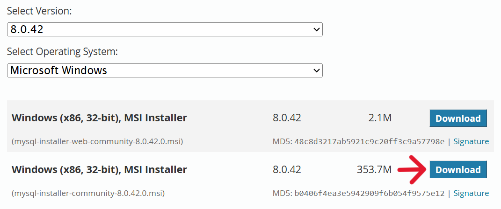

# MySQL setup

This guide will show you how to setup a MySQL server on your computer.

## Table of contents
- [Downloading MySQL](#download-mysql-installer---community)
- [Installer guide](#2-navigating-the-installer)
- [Add MySQL to PATH](#3-adding-mysql-to-path)
- [Useful code snippets](#4-useful-mysql-code-snippets)

### 1. Download MySQL Installer - Community

You can download the installer using the link [here](https://dev.mysql.com/downloads/installer/).

Once on the webpage, locate **(mysql-installer-community-8.0.42.0.msi)** and click "Download".

### 2. Navigating the installer

We will download 3 products, namely MySQL Server, MySQL Workbench, and MySQL Shell.

1. Under *Choosing a setup type*: Select the "Custom" radio button.
2. Under *Select Products*: "Available Products:"  
- MySQL Servers > MySQL Server > MySQL Server 8.0 > *Choose the latest version* > Click the right arrow
- Applications > MySQL Workbench > MySQL Workbench 8.0 > *Choose the latest version* > Click the right arrow
- Applications > MySQL Shell > MySQL Shell 8.0 > *Choose the latest version* > Click the right arrow  
3. Click "Next" > Under *Installation*, click "Execute"
4. Click "Next" > Under *Product Configuration*, click "Next"
5. Under *Type and Networking*, leave everything as is. MySQL port is 3306 by default.
6. Under *Authentication Method*, leave everything as is.
7. Under *Accounts and Roles*, set a root password. This will be the password to your "root" account. You may also add a user at this point with the "Add User" button. Set "Host" as "localhost"
8. Under *Windows Service*, leave everything as is.
9. Under *Server File Permissions*, leave everything as is.
10. Under *Apply Configuration*, click "Execute". Wait for the steps to be executed > click "Finish"
11. Under *Product Configuration*, click "Next" > Under *Installation Complete*, click "Finish"

### 3. Adding MySQL to PATH

1. Go to "Start" on your computer > search "Edit the system environment variables"
2. Click "Environment variables..."
3. Under "System variables", double click "Path"
4. Click "New" > paste the path `C:\Program Files\MySQL\MySQL Server 8.0\bin\` in the highlighted field.
5. Press "Ok" for all.

What this does is tell Windows where to look for a program when running it from the command line, in this case, the path is: `C:\Program Files\MySQL\MySQL Server 8.0\bin\`. The program can now be called using an alias `mysql` from any directory.

### 4. Useful MySQL code snippets

 Press <kbd>Win</kbd> + <kbd>X</kbd> and open Windows Terminal (Admin) and type...
- `net start mysql80`: starts the MySQL server
- `net stop mysql80`: stops the MySQL server
- `mysql --version`: prints the current version of MySQL installed.
- `mysql -u root -p`: `-u` represents the user. In this case, "root" is the username. `-p` represents the passsword.  
Enter the password set under *Chapter 2, Step 7*. If successful, you should be connected to the mysql database (shown by the `mysql>` console flag.)
